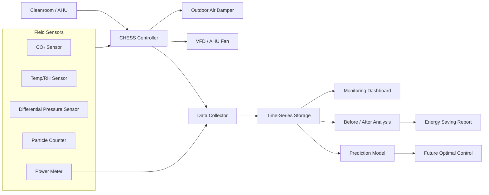
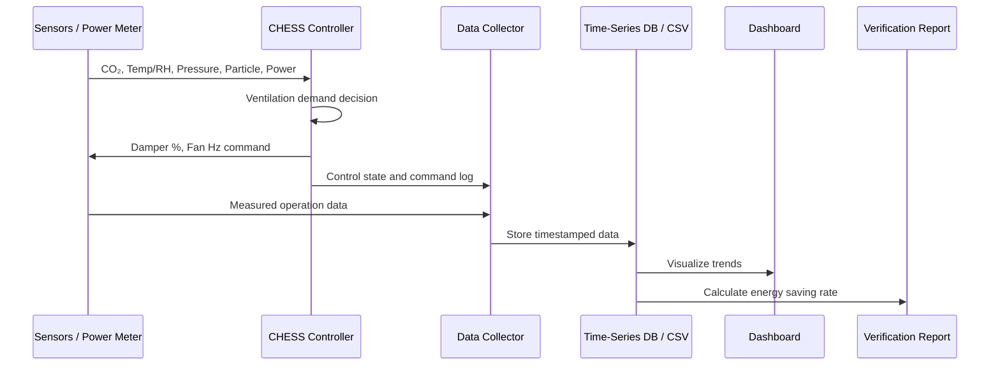
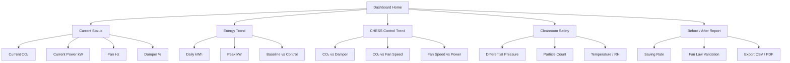

# CHESS 연계 문서: 전력 시계열 모니터링 기반 실증 체계

## 1. 문서 목적

이 문서는 `electric-time-series-monitoring` 프로젝트를 크린룸 하이브리드 에너지 절감 제어 시스템(CHESS, Cleanroom Hybrid Energy Saving control System)의 실증 데이터 수집·저장·모니터링·검증 모듈로 연계하기 위한 설계 문서이다.

CHESS 본체는 CO₂ 농도, 온습도, 차압, 입자 농도 등 운전 조건을 기반으로 외기 댐퍼와 AHU 팬 인버터를 제어하는 시스템이다. 반면 본 저장소는 CHESS가 실제 현장에서 소비전력을 얼마나 줄였는지, 팬 주파수와 전력 사용량이 어떤 관계를 보이는지, CO₂ 농도와 에너지 사용량이 시간에 따라 어떻게 변화하는지를 시계열 데이터로 기록하고 검증하는 역할을 담당한다.

핵심 연결 구조는 다음과 같다.

> CHESS 제어 시스템 → 운전 데이터 수집 → 시계열 저장 → 대시보드 시각화 → Before/After 절감율 검증 → 예측·최적제어 확장

---

## 2. CHESS와 본 프로젝트의 역할 분담

| 구분 | CHESS 제어 시스템 | electric-time-series-monitoring |
|---|---|---|
| 주 역할 | 크린룸 환기·팬 제어 | 전력 시계열 수집·저장·분석·시각화 |
| 입력 데이터 | CO₂, 온습도, 차압, 입자 농도, 운전 상태 | 전력량, 팬 주파수, 댐퍼 개도율, CO₂, 온습도, 차압, 입자 농도 |
| 출력/기능 | 댐퍼 개도율 제어, VFD 팬 속도 제어, 알람 | 대시보드, 절감율 리포트, 이상 탐지, 예측 모델 |
| 실증 기여 | 에너지 절감 제어 수행 | 제어 효과의 정량 검증 |
| 연구노트 연계 | 제어 알고리즘 및 하드웨어 구성 | 실증 데이터, Before/After 비교, Fan Law 검증 |

---

## 3. 전체 시스템 개념도

GitHub Markdown에서 바로 렌더링 가능한 Mermaid 다이어그램을 사용한다. 별도의 이미지 파일을 두지 않아도 문서 안에서 구조도를 확인할 수 있다.



---

## 4. 데이터 흐름



---

## 5. 수집 대상 데이터 정의

CHESS 실증에서는 단순 소비전력뿐 아니라 제어 판단값과 크린룸 안전 조건을 함께 기록해야 한다. 특히 CO₂ 기반 제어는 크린룸 청정도, 차압, 온습도 조건을 침해하지 않는 범위에서만 적용되어야 하므로 관련 계측값을 함께 저장한다.

| 필드명 | 단위 | 설명 | 활용 목적 |
|---|---:|---|---|
| `timestamp` | ISO 8601 | 측정 시각 | 전체 시계열 기준 |
| `site_id` | - | 현장 식별자 | 다중 현장 비교 |
| `ahu_id` | - | AHU 식별자 | 장비별 성능 분석 |
| `co2_ppm` | ppm | 실내 CO₂ 농도 | 재실/환기 수요 판단 |
| `outdoor_co2_ppm` | ppm | 외기 CO₂ 농도, 없으면 기준값 사용 | CO₂ 차분 계산 |
| `temperature_c` | °C | 실내 온도 | 온도 안정성 검증 |
| `relative_humidity_pct` | %RH | 실내 상대습도 | 습도 안정성 검증 |
| `differential_pressure_pa` | Pa | 실내외 또는 구역 간 차압 | 양압/압력 계층 유지 검증 |
| `particle_count` | count/m³ | 입자 농도 | 청정도 유지 검증 |
| `damper_position_pct` | % | 외기 댐퍼 개도율 | 외기량 제어 추적 |
| `fan_frequency_hz` | Hz | 인버터 출력 주파수 | 팬 속도 제어 추적 |
| `fan_speed_pct` | % | 기준 속도 대비 팬 속도 | Fan Law 계산 입력 |
| `power_kw` | kW | 순간 소비전력 | 실시간 전력 분석 |
| `energy_kwh` | kWh | 누적 전력량 | 기간별 절감율 계산 |
| `operation_mode` | - | baseline, control, alarm 등 | Before/After 구분 |
| `alarm_code` | - | 이상/알람 코드 | 안전 조건 이탈 분석 |

---

## 6. 데이터 저장 예시

초기 실증 단계에서는 CSV 또는 SQLite로 시작할 수 있고, 데이터가 증가하면 InfluxDB, TimescaleDB, Prometheus 계열 저장소로 확장할 수 있다.

### CSV 예시

```csv
timestamp,site_id,ahu_id,co2_ppm,temperature_c,relative_humidity_pct,differential_pressure_pa,particle_count,damper_position_pct,fan_frequency_hz,fan_speed_pct,power_kw,energy_kwh,operation_mode,alarm_code
2026-10-01T08:00:00+09:00,SITE-A,AHU-01,612,22.4,48.2,12.5,1800,15,36,60,12.4,10521.4,control,
2026-10-01T09:00:00+09:00,SITE-A,AHU-01,742,22.6,49.1,12.2,2100,28,44,73,14.8,10536.2,control,
2026-10-01T10:00:00+09:00,SITE-A,AHU-01,895,22.8,50.3,11.8,2600,52,52,87,18.2,10554.4,control,
```

### Python 데이터 구조 예시

```python
record = {
    "timestamp": "2026-10-01T08:00:00+09:00",
    "site_id": "SITE-A",
    "ahu_id": "AHU-01",
    "co2_ppm": 612,
    "temperature_c": 22.4,
    "relative_humidity_pct": 48.2,
    "differential_pressure_pa": 12.5,
    "particle_count": 1800,
    "damper_position_pct": 15,
    "fan_frequency_hz": 36,
    "fan_speed_pct": 60,
    "power_kw": 12.4,
    "energy_kwh": 10521.4,
    "operation_mode": "control",
    "alarm_code": None,
}
```

---

## 7. Fan Law 기반 이론값과 실측값 비교

Fan Law는 CO₂ 농도와 직접 연결되는 이론이 아니라, CO₂ 기반 환기 수요 판단 결과에 따라 인버터로 팬 풍량을 낮추었을 때 팬 소비전력이 얼마나 감소할 수 있는지를 추정하는 계산식이다.

```text
P₂ = P₁ × (Q₂ / Q₁)³
```

| 운전 조건 | 기준 풍량 대비 제어 풍량 | 팬 전력 잔존율 | 이론 팬 전력 절감율 | 검증 방법 |
|---|---:|---:|---:|---|
| 경부하 | 100% → 70% | 0.7³ = 34.3% | 65.7% | 실측 `power_kw`와 비교 |
| 중부하 | 100% → 85% | 0.85³ = 61.4% | 38.6% | 실측 `power_kw`와 비교 |
| 최대 부하 | 100% → 100% | 100% | 0% | 기준 운전값으로 사용 |

주의할 점은 0.7³ = 34.3%가 “절감율”이 아니라 “전력 잔존율”이라는 것이다. 절감율은 `1 - 0.343 = 0.657`, 즉 65.7%로 계산해야 한다.

실제 현장에서는 덕트 저항, 필터 차압, 인버터 효율, 최소 차압 유지 조건, 온습도 부하 때문에 이론값과 실측값이 다를 수 있다. 따라서 본 프로젝트에서는 이론 절감율을 그대로 성과로 주장하기보다, 실측 전력 데이터를 이용해 보정된 절감율을 산정한다.

---

## 8. Before/After 실증 평가 방법

CHESS 적용 전후를 동일하거나 유사한 조건에서 비교한다.

| 구분 | Baseline 기간 | Control 기간 |
|---|---|---|
| 운전 방식 | 기존 고정 풍량 또는 기존 제어 | CHESS 제어 적용 |
| 권장 기간 | 4주 이상 | 4주 이상 |
| 비교 지표 | 평균 kW, 일간 kWh, 피크 전력 | 평균 kW, 일간 kWh, 피크 전력 |
| 보정 변수 | 외기 조건, 생산 일정, 재실 패턴 | 외기 조건, 생산 일정, 재실 패턴 |
| 안전 조건 | 차압, 입자 농도, 온습도 | 차압, 입자 농도, 온습도 |

### 절감율 계산식

```text
Energy Saving Rate (%) = (Baseline Energy - Control Energy) / Baseline Energy × 100
```

### 대시보드 권장 그래프

| 그래프 | x축 | y축 | 목적 |
|---|---|---|---|
| CO₂ 농도 추이 | 시간 | ppm | 환기 수요 변화 확인 |
| 팬 주파수 추이 | 시간 | Hz | 인버터 제어 상태 확인 |
| 순간 전력 추이 | 시간 | kW | 전력 저감 패턴 확인 |
| 누적 전력 비교 | 날짜 | kWh | Before/After 절감량 확인 |
| CO₂ vs 전력 산점도 | CO₂ ppm | kW | 환기 수요와 전력의 상관 확인 |
| 팬 속도 vs 전력 산점도 | fan speed % | kW | Fan Law와 실측값 비교 |
| 차압/입자 농도 추이 | 시간 | Pa, count/m³ | 크린룸 안전 조건 유지 확인 |

---

## 9. 대시보드 화면 구성 제안



---

## 10. 예측 모델 확장 방향

본 프로젝트의 장기 목표는 단순 모니터링을 넘어 예측 기반 운전 지원으로 확장하는 것이다.

| 단계 | 모델 입력 | 모델 출력 | 활용 |
|---|---|---|---|
| 1단계 | 시간, 요일, CO₂, 팬 Hz, 댐퍼 %, 외기 조건 | 다음 시간대 전력 kW | 전력 피크 예측 |
| 2단계 | CO₂, 재실 패턴, 생산 일정 | 다음 시간대 환기 수요 | 사전 환기 제어 |
| 3단계 | 팬 Hz, 차압, 입자 농도, 필터 차압 | 청정도/차압 이탈 위험 | 안전 알람 |
| 4단계 | 전체 시계열 데이터 | 최적 팬 속도/댐퍼 개도율 | 예측 제어 또는 추천 제어 |

초기에는 선형회귀, Random Forest, XGBoost, LSTM 등을 비교하고, 실증 데이터가 충분히 누적된 이후 예측 제어 또는 강화학습 기반 최적화로 확장할 수 있다.

---

## 11. 구현 우선순위

| 우선순위 | 작업 | 설명 |
|---:|---|---|
| 1 | 데이터 스키마 확정 | CSV/DB 공통 필드 정의 |
| 2 | 샘플 데이터 생성 | Before/After 분석 테스트용 |
| 3 | 수집 모듈 구현 | 전력계, 센서, CHESS 로그 수집 |
| 4 | 대시보드 구현 | CO₂, 팬 Hz, 전력, 절감율 시각화 |
| 5 | 리포트 자동 생성 | 일간/주간/실증 종료 보고서 |
| 6 | 예측 모델 추가 | 전력 사용량 및 환기 수요 예측 |

---

## 12. 연구노트에 반영할 수 있는 문장

아래 문장은 CHESS 연구노트의 “실증 계획”, “데이터 수집 설계”, “소프트웨어 모듈 구성” 항목에 사용할 수 있다.

> 본 연구에서는 CHESS 제어 알고리즘의 현장 실증을 위해 별도의 전력 시계열 모니터링 모듈을 연계한다. 해당 모듈은 AHU 운전 중 발생하는 소비전력(kW, kWh), 팬 인버터 주파수(Hz), CO₂ 농도(ppm), 외기 댐퍼 개도율(%), 온습도, 차압, 입자 농도 데이터를 시간 단위로 수집·저장하고, 대시보드를 통해 제어 전후의 운전 패턴과 에너지 절감 효과를 비교 분석한다.
>
> 이를 통해 단순히 제어 알고리즘을 구현하는 데 그치지 않고, Before/After 실증 데이터 기반으로 팬 전력 절감율, CO₂ 농도 안정성, 경부하 시간대 에너지 저감 효과를 정량 검증할 수 있다. 특히 Fan Law 기반 이론 절감율과 실제 전력 계측값을 비교함으로써 CHESS 제어 로직의 실효성을 검증하는 데이터 기반 평가 체계를 구축한다.

---

## 13. 요약

`electric-time-series-monitoring` 프로젝트는 CHESS의 제어 기능을 직접 대체하는 것이 아니라, CHESS 제어 결과를 검증하는 데이터 기반 실증 플랫폼으로 연결하는 것이 가장 적절하다.

정리하면 다음과 같다.

```text
CHESS = 제어 시스템
본 저장소 = 실증 데이터 모니터링 및 검증 시스템
```

따라서 본 저장소의 개발 방향은 “전력 시계열 모니터링”에서 출발하되, CHESS 실증에 필요한 CO₂, 팬 주파수, 댐퍼 개도율, 차압, 입자 농도 데이터를 함께 수집하는 방향으로 확장하는 것이 바람직하다.
